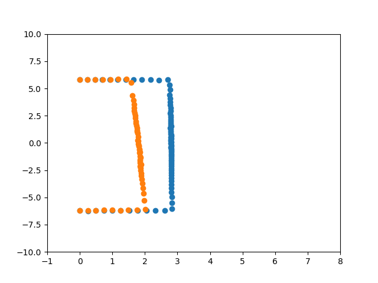
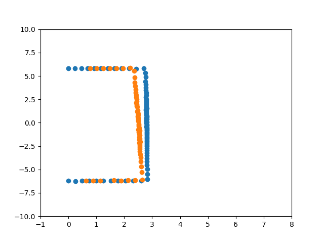
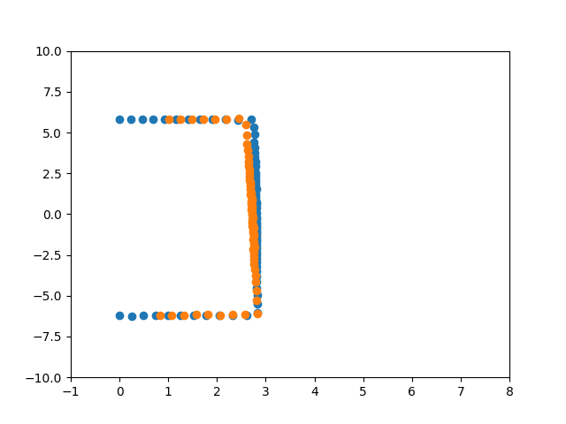
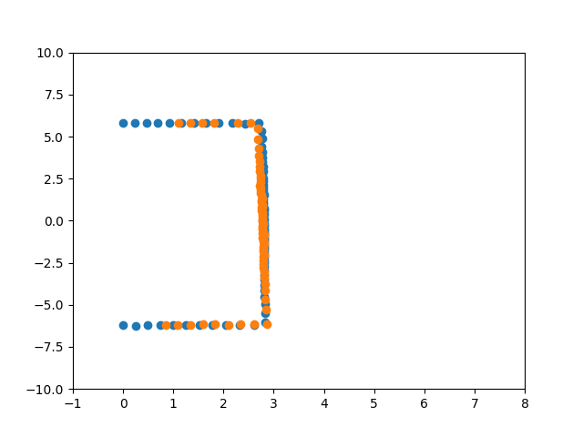
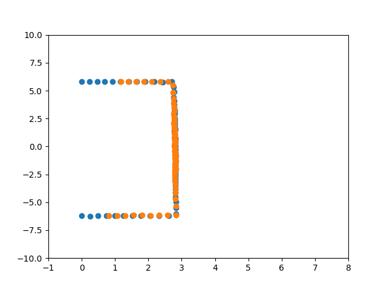

# ICP algorithm (Point-to-Point Variant)

The Iterative closest point algorithm is employed to estimate transformation between 2 point clouds such that corresponding points between each set are aligned over each other in space.Initially, we start with a transformation guess which would align the 2 point clouds. Points of set one are transformed into the reference frame of set two.Then each point  in  one  data  set  is  paired  with  the  closest  point  in  the  other data set to form correspondence pairs.To solve for optimal transformation, a point-to-point error metric  is  used in  which the sum  of  the  squared distance  between points  in  each  correspondence  pair  is  minimized.The process is repeated with the transformation we just obtained as our new initial guess. It is iterated until the error becomes smaller than a threshold or it stops changing.

## Closed form solution

The source point cloud and target point cloud are represented as  and  respectively. For data association between these two sets, brute force search methods has been used. In case when multiple source points are matched with same point from the target set, the pair with minumum distance is retained while others are rejected. Morever, unmatched target points are also removed,which consequently leaves us with best one to one correspondences. Following steps are performed on the resultant point sets to solve for optimal translation and rotation.

- step 1 : Calculate centroids of both point clouds
    
    

    
    
- step 2 : Compute the spread matrix

    
    
- step 3 : Use SVD to obtain optimal rotation matrix

    

    
    
    
- step 4 : Obtain translation vector by applying the transform on centroids

    

Repeat until convergence.

# TESTS

The implementation was done in Gazebo simulator(Version 7.0). A hokuyo laser scanner was mounted on top of turtlebot2. Point clouds were recorded in the following environment : 

Test 1 :

Translational motion of 1m along positive x-axis :

Source scan:

`[(-2.250098805234302e-05, -6.215759754180908, 0.0), (0.2467063069343567, -6.201075077056885, 0.0), (0.4938106834888458, -6.195971965789795, 0.0), (0.7399365305900574, -6.172987461090088, 0.0), (0.989570677280426, -6.168624401092529, 0.0), (1.2446379661560059, -6.177042484283447, 0.0), (1.4924389123916626, -6.135859966278076, 0.0), (1.7542717456817627, -6.13840913772583, 0.0), (2.0081965923309326, -6.098032474517822, 0.0), (1.9752782583236694, -5.281387805938721, 0.0), (1.9528584480285645, -4.64915132522583, 0.0), (1.933587908744812, -4.134689807891846, 0.0), (1.9243152141571045, -3.7216553688049316, 0.0), (1.9022923707962036, -3.345904588699341, 0.0), (1.8852344751358032, -3.0289206504821777, 0.0), (1.877898097038269, -2.7656211853027344, 0.0), (1.8726969957351685, -2.5349128246307373, 0.0), (1.866689920425415, -2.3271732330322266, 0.0), (1.84701669216156, -2.123810052871704, 0.0), (1.8787610530853271, -1.9943180084228516, 0.0), (1.8534547090530396, -1.816969394683838, 0.0), (1.854594349861145, -1.6788140535354614, 0.0), (1.8415988683700562, -1.5383692979812622, 0.0), (1.8294833898544312, -1.4086384773254395, 0.0), (1.8583539724349976, -1.3165931701660156, 0.0), (1.8448882102966309, -1.199826955795288, 0.0), (1.8332774639129639, -1.0910996198654175, 0.0), (1.8186267614364624, -0.9866560101509094, 0.0), (1.8269505500793457, -0.899073600769043, 0.0), (1.8488351106643677, -0.8202215433120728, 0.0), (1.8058425188064575, -0.716647207736969, 0.0), (1.8271673917770386, -0.6422691345214844, 0.0), (1.8254592418670654, -0.5611884593963623, 0.0), (1.805516004562378, -0.47738027572631836, 0.0), (1.7950619459152222, -0.3989967107772827, 0.0), (1.806512475013733, -0.3267742693424225, 0.0), (1.8062620162963867, -0.2530401349067688, 0.0), (1.8065942525863647, -0.18020136654376984, 0.0), (1.800532579421997, -0.10753026604652405, 0.0), (1.7909929752349854, -0.035615772008895874, 0.0), (1.7972136735916138, 0.03573990240693092, 0.0), (1.7781511545181274, 0.10619404166936874, 0.0), (1.786808967590332, 0.17822827398777008, 0.0), (1.7836275100708008, 0.2498696893453598, 0.0), (1.7768172025680542, 0.32140323519706726, 0.0), (1.7893664836883545, 0.3977311849594116, 0.0), (1.7813221216201782, 0.4709838330745697, 0.0), (1.7854706048965454, 0.548895537853241, 0.0), (1.7671229839324951, 0.6211633682250977, 0.0), (1.769968867301941, 0.7024112343788147, 0.0), (1.7568796873092651, 0.7794266939163208, 0.0), (1.774228572845459, 0.8731287121772766, 0.0), (1.7710117101669312, 0.9608240723609924, 0.0), (1.7571741342544556, 1.0458062887191772, 0.0), (1.7551064491271973, 1.1414377689361572, 0.0), (1.7388331890106201, 1.2319165468215942, 0.0), (1.7546107769012451, 1.3509899377822876, 0.0), (1.7328027486801147, 1.447487711906433, 0.0), (1.7385947704315186, 1.5738097429275513, 0.0), (1.7255043983459473, 1.6915385723114014, 0.0), (1.7210841178894043, 1.8269436359405518, 0.0), (1.717645525932312, 1.9750523567199707, 0.0), (1.7000652551651, 2.119446039199829, 0.0), (1.6995909214019775, 2.3005948066711426, 0.0), (1.7042362689971924, 2.509866952896118, 0.0), (1.69053316116333, 2.71610426902771, 0.0), (1.6743218898773193, 2.9449331760406494, 0.0), (1.6698473691940308, 3.2295124530792236, 0.0), (1.6608467102050781, 3.5514755249023438, 0.0), (1.6416102647781372, 3.908168315887451, 0.0), (1.6191637516021729, 4.3292317390441895, 0.0), (1.6021220684051514, 4.864962100982666, 0.0), (1.5797020196914673, 5.527573585510254, 0.0), (1.423742651939392, 5.853435516357422, 0.0), (1.17692232131958, 5.840981960296631, 0.0), (0.9352920651435852, 5.830280303955078, 0.0), (0.6986232995986938, 5.82834005355835, 0.0), (0.4628547132015228, 5.807576656341553, 0.0), (0.23113159835338593, 5.809632301330566, 0.0), (-2.237968692497816e-05, 5.805843353271484, 0.0)]`

Target scan:

>[(-2.2541122234542854e-05, -6.226846218109131, 0.0), (0.24891646206378937, -6.256628513336182, 0.0), (0.49543043971061707, -6.21629524230957, 0.0), (0.7458614110946655, -6.222416400909424, 0.0), (0.9955333471298218, -6.205793857574463, 0.0), (1.2514573335647583, -6.210886478424072, 0.0), (1.5136431455612183, -6.223036766052246, 0.0), (1.773485541343689, -6.2056403160095215, 0.0), (2.0439629554748535, -6.206639766693115, 0.0), (2.3216779232025146, -6.207571983337402, 0.0), (2.6074979305267334, -6.207644939422607, 0.0), (2.822584390640259, -6.0356764793396, 0.0), (2.833462715148926, -5.4799604415893555, 0.0), (2.8218326568603516, -4.963265419006348, 0.0), (2.817556142807007, -4.526839256286621, 0.0), (2.8124642372131348, -4.141976833343506, 0.0), (2.8107495307922363, -3.804676055908203, 0.0), (2.805089235305786, -3.497061252593994, 0.0), (2.813107490539551, -3.2346789836883545, 0.0), (2.804293394088745, -2.9767768383026123, 0.0), (2.8087081909179688, -2.7534186840057373, 0.0), (2.80316424369812, -2.537477493286133, 0.0), (2.8055593967437744, -2.3436083793640137, 0.0), (2.8079326152801514, -2.162010431289673, 0.0), (2.8143906593322754, -1.9939191341400146, 0.0), (2.8143327236175537, -1.8303072452545166, 0.0), (2.8145763874053955, -1.6751328706741333, 0.0), (2.806795120239258, -1.5227651596069336, 0.0), (2.815809965133667, -1.385708212852478, 0.0), (2.8084731101989746, -1.2459574937820435, 0.0), (2.805471658706665, -1.113349199295044, 0.0), (2.8105475902557373, -0.9879379272460938, 0.0), (2.8167169094085693, -0.865924060344696, 0.0), (2.8125460147857666, -0.7436400055885315, 0.0), (2.8160505294799805, -0.6259365677833557, 0.0), (2.8108069896698, -0.5084379315376282, 0.0), (2.7997546195983887, -0.39221903681755066, 0.0), (2.805360794067383, -0.27982479333877563, 0.0), (2.8191943168640137, -0.16836613416671753, 0.0), (2.793386697769165, -0.05554942041635513, 0.0), (2.810610294342041, 0.055892594158649445, 0.0), (2.800051212310791, 0.16722354292869568, 0.0), (2.797532081604004, 0.27904456853866577, 0.0), (2.80890154838562, 0.3935011029243469, 0.0), (2.7935092449188232, 0.5053096413612366, 0.0), (2.816277027130127, 0.6259876489639282, 0.0), (2.8126728534698486, 0.7436742782592773, 0.0), (2.790456533432007, 0.8578516840934753, 0.0), (2.795827865600586, 0.9827645421028137, 0.0), (2.799292802810669, 1.1108978986740112, 0.0), (2.797888994216919, 1.2412627935409546, 0.0), (2.780109405517578, 1.3681402206420898, 0.0), (2.804016590118408, 1.5212584733963013, 0.0), (2.7905898094177246, 1.660857915878296, 0.0), (2.7946324348449707, 1.8174959421157837, 0.0), (2.7867989540100098, 1.974372148513794, 0.0), (2.796051263809204, 2.1528632640838623, 0.0), (2.795804262161255, 2.335460662841797, 0.0), (2.79565167427063, 2.5306782722473145, 0.0), (2.7819976806640625, 2.7272353172302246, 0.0), (2.787518262863159, 2.9589712619781494, 0.0), (2.785477876663208, 3.2029104232788086, 0.0), (2.7771549224853516, 3.4622373580932617, 0.0), (2.771301031112671, 3.751279592514038, 0.0), (2.7738025188446045, 4.085041522979736, 0.0), (2.7562692165374756, 4.428374767303467, 0.0), (2.774522542953491, 4.8800554275512695, 0.0), (2.7583234310150146, 5.3346428871154785, 0.0), (2.7058558464050293, 5.786073207855225, 0.0), (2.427443265914917, 5.778994560241699, 0.0), (2.1705329418182373, 5.803452491760254, 0.0), (1.9093601703643799, 5.797913074493408, 0.0), (1.6572589874267578, 5.798954963684082, 0.0), (1.407502293586731, 5.786665916442871, 0.0), (1.1662383079528809, 5.787958145141602, 0.0), (0.9317261576652527, 5.808051586151123, 0.0), (0.6952478885650635, 5.800179958343506, 0.0), (0.46153706312179565, 5.791043281555176, 0.0), (0.23047609627246857, 5.793155670166016, 0.0), (-2.2434764105128124e-05, 5.820131301879883, 0.0)]

Resultant Transformation Matrix:

`M : [[ 0.99943548  0.03359631  1.01173327]
 	[-0.03359631  0.99943548  0.03959641]
 	[ 0.          0.          1.        ]]`

Note - The matrix is represented for homogeneous coordinates.

Translation in x 

Translation in y 

Rotation about z-axis &space;=&space;-1.89^{\circ})

Iterations :

> Blockquote

